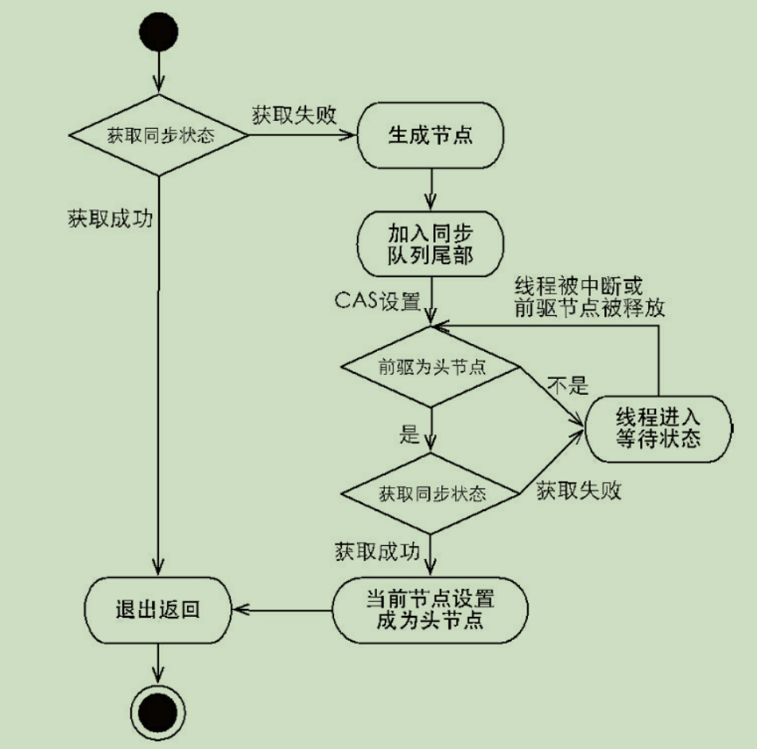

# Java锁

## Lock接口

锁接口出现前，Java靠synchronized实现锁功能，JavaSE5后，并发包新增了Lock接口来实现锁功能。

不要将获取锁过程写在try块中

## 队列同步器(AbstractQueuedSynchronizer)

为用来构建锁或者其他同步组件的基础框架，内置int成员表示同步状态，内置FIFO队列来完成资源获取线程的排队工作。主要使用方式是继承。子类推荐是自定义同步组件的静态内部类。

同步器是实现锁的关键。同步器的设计基于模板方法模式。自定义同步组件将使用同步器提供的模板方法来实现自己的同步语义。

访问修改同步状态：

* getState()
* setState(int newState)
* compareAndSetState(int expect,int update)

### 同步队列

同步器依赖于内部的同步队列(FIFO双向)完成同步状态的管理，当前线程获取状态失败时，同步器会将相关信息构造成一个Node并加入同步队列，并阻塞该线程。

### 独占式同步状态获取与释放

调用同步器acquire方法，该方法对中断不敏感，即或许同步状态失败进入同步队列后，中断操作不会使其从同步队列中移除。独占式同步状态获取流程如下：

同步状态获取成功后，当前线程从acquire方法返回，意味着当前线程获得了锁

release方法可以释放同步状态，同时唤醒后继节点。

总结(独占式)：获取同步状态时，同步器维护一个同步队列，获取状态失败的线程都会被加入队列进行自旋；移出队列的条件是前驱节点为头结点并且获取了同步状态。释放同步状态时，调用tryRelease释放同步状态，并唤醒头结点的后继结点。

### 共享式同步状态获取与释放

与独占式最主要的区别是同一时刻能否有多个线程获取到同步状态。通过acquireShared可以共享地获取同步状态。

共享式获取的自选过程中成功获得同步状态并退出的条件是tryAcquireShared(int arg)方法返回值大于等于0。

## 重入锁(ReentrantLock)

表示该锁支持一个线程对资源的重复加锁，且支持获取锁时的公平和非公平性选择。即获取锁后能再次获取而不会被阻塞

成功获取锁的线程再次获取锁，只是增加了同步状态值，这也要求ReentrantLock在释放同步状态时减少同步状态值。

如果一个锁时公平的，则锁的获取顺序就应该符合FIFO。

对于非公平锁，只要CAS设置同步状态成功，则表示当前线程获取了锁。而公平锁则不同，需要判断同步队列中是否存在前驱。

非公平锁虽然可能造成线程‘饥饿’，但极少的线程切换保证了更大的吞吐量。

## 读写锁

同一时刻允许多个线程进行读访问，但在写线程访问时，所有的其他线程均被阻塞。读写锁维护了一对读锁和写锁。实现读写分离。

### 实现

#### 读写状态设计:

读写状态即同步器同步状态，表示一个锁被线程重复获取的次数，而读写锁的同步器在一个同步状态变量上维护多个读线程和一个写线程的状态。这里用到了**按位切割使用**。高16位表示读，低16位表示写。(通过位运算操作)

#### 读/写锁的获取与释放

如果存在读锁，则写锁不能被获取。只有等待其他线程都释放了读锁，写锁才能被当前线程获取，而写锁一旦获取，其他读写线程的后续访问均被堵塞。

#### 锁降级

写锁降级为读锁，即把持住当前拥有的写锁，在获取到读锁，随后释放写锁的过程。

## LockSupport

定义了一组公共静态方法，提供了最基本的线程阻塞和唤醒功能，LockSupport为构建同步工具的基础组件。

## Condition接口

任意一个Java对象都有一组监视器方法(定义在Object上)，包括wait,notify。Condition接口提供了类似Object的监视器方法，可以与Lock配合实现消费/生产模式

