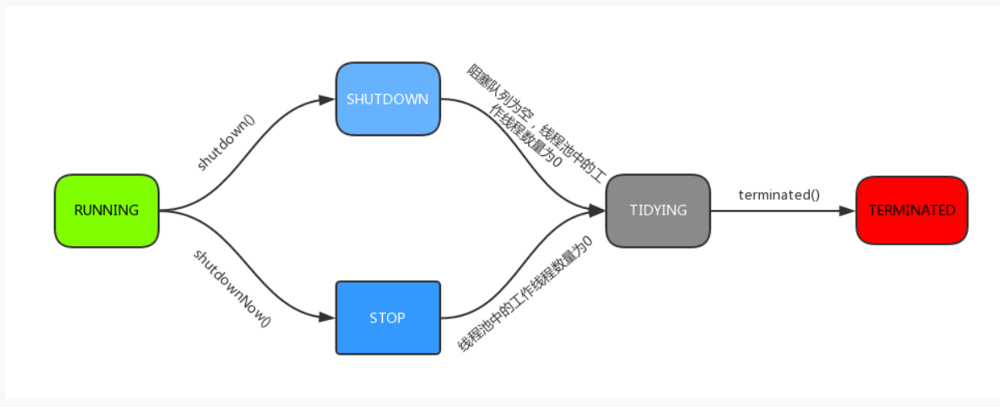

# 并发工具类

## CountDownLatch

允许一个或多个线程等待其他线程完成操作，普通情况下也可以用Join完成。join用于让当前线程等待join线程执行结束。

CountDownLatch提供了更加丰富的功能。

## 同步屏障CyclicBarrier

让一组线程到达一个屏障(同步点)时被阻塞，直到最后一个线程到达屏障。CyclicBarrier可以用于多线程计算数据

## Semaphore

控制并发线程数量。

## Exchanger

线程间交换数据

# 线程池

普通情况下new一个线程时的创建和销毁会带来开销，而线程池里的线程是可复用的。同时提供了资源限制和管理的手段。Java线程池依靠ThreadPoolExecutor类实现。

1. 若当前运行线程<corePoolSize，则创建新线程来执行任务（需要获取全局锁）
2. 如果运行的线程大于等于corePoolSize，则将任务加入BlockingQueue
3. 如果无法加入（队列已满），则创建新的线程处理任务（需要获取全局锁）
4. 如果创建新线程会使运行的线程超出maximumPoolSize，任务将被拒绝，并调用rejectedExecution

采取以上策略的原因，在于尽可能的避免获取全局锁。因为大部分调用后都会执行第二步。

线程池类型：

* newFixedThreadPool：
* newSingleThreadExecutor:核心和最大线程数都为1
* newCachedThreadPool:加入同步队列的任务会被马上执行，同步队列中最多只有一个任务。

线程池运行状态:

1. RUNNING:可以提交新任务，并处理阻塞队列中的任务

2. SHUTDOWN：关闭状态，不再接受新提交的任务，但可以继续处理阻塞队列中的任务。

3. STOP：不接受新任务，也不处理队列中的任务

4. TIDYING：如果所有任务已终止，有效线程数位0，线程进入该状态后会调用terminated()进入TERMINATED状态。

5. TERMINATED：

   

execute方法的运行流程如下

### addWorker:

addWorker方法主要在线程池创建一个新的线程并执行，最终会调用Worker的run方法，Worker本身实现了Runnable接口。线程池中的每一个对象都被封装成一个Worker对象，而ThreadPool维护的就是一组Worker对象。

Worker继承了AQS，使用AQS实现独占锁的功能，不用ReentrantLock的原因是不允许重入。